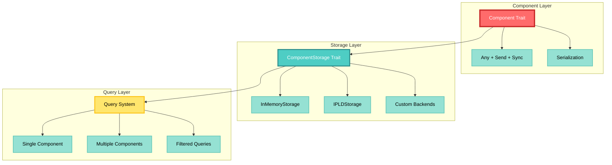
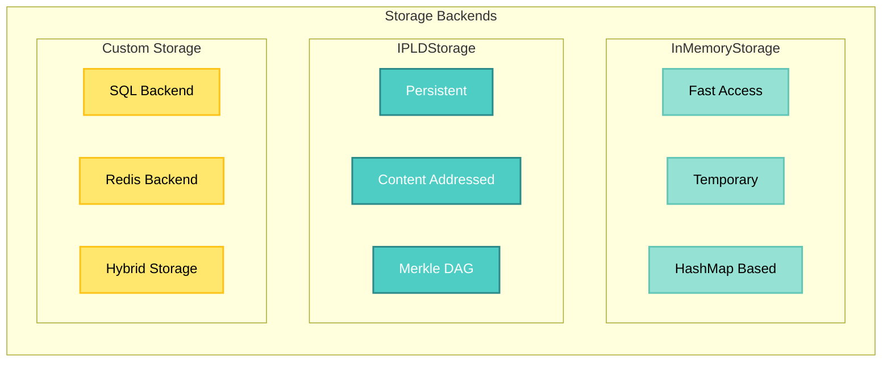
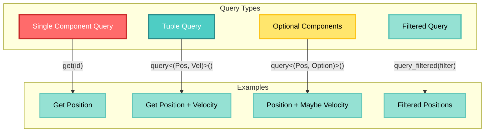
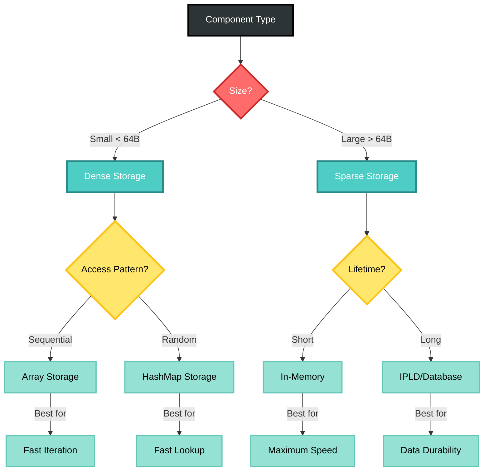
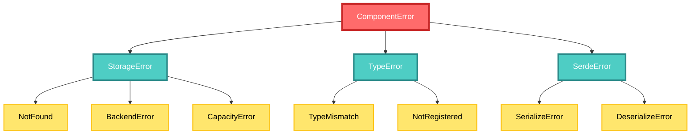
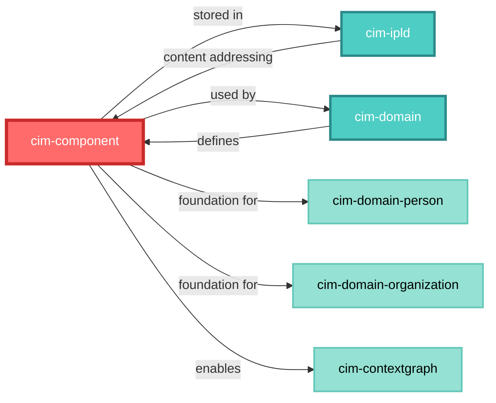
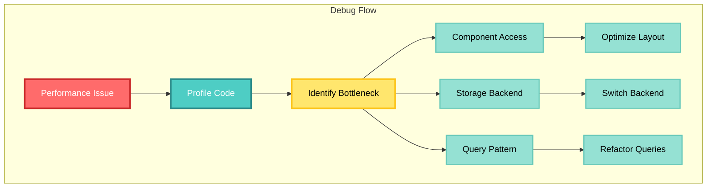

# CIM Module Guide for Claude

PLEASE READ main.mdc IN .claude
**YOU MUST FOLLOW THESE DIRECTIVES**

## Overview

The `cim-component` module is a foundational type-erased component system for CIM. It provides the building blocks for Entity Component System (ECS) patterns used throughout the CIM architecture. This module has zero dependencies on other CIM modules and serves as a core abstraction.

## Key Concepts

### Type Erasure
- Components are stored without compile-time type knowledge
- Uses `Any` trait for runtime type checking
- Enables heterogeneous component storage

### Component Storage
- Pluggable storage backends (in-memory, IPLD, custom)
- Thread-safe access (`Send + Sync`)
- Query system for efficient component retrieval

## Architecture Diagrams

### Component System Architecture



### Storage Backend Comparison



## Module Structure

```
cim-component/
├── src/
│   ├── lib.rs              # Public API exports
│   ├── component.rs        # Component trait definition
│   ├── storage/
│   │   ├── mod.rs         # Storage trait
│   │   ├── memory.rs      # In-memory implementation
│   │   └── ipld.rs        # IPLD storage implementation
│   ├── query/
│   │   ├── mod.rs         # Query system
│   │   ├── single.rs      # Single component queries
│   │   └── multi.rs       # Multi-component queries
│   ├── error.rs           # Error types
│   └── serde.rs           # Serialization support
├── tests/
│   ├── component_tests.rs
│   ├── storage_tests.rs
│   └── query_tests.rs
└── benches/
    └── component_bench.rs
```

## Common Tasks

### Implementing a New Component

```rust
use cim_component::Component;
use serde::{Serialize, Deserialize};

#[derive(Debug, Clone, Serialize, Deserialize)]
pub struct MyComponent {
    pub value: String,
}

impl Component for MyComponent {
    fn component_type() -> &'static str {
        "MyComponent"
    }
}
```

### Creating a Storage Backend

```rust
use cim_component::{ComponentStorage, StorageError};

pub struct MyStorage {
    // Implementation details
}

impl ComponentStorage for MyStorage {
    fn store<C: Component>(&self, id: Uuid, component: C) -> Result<(), StorageError> {
        // Store component
    }
    
    fn get<C: Component>(&self, id: Uuid) -> Result<Option<C>, StorageError> {
        // Retrieve component
    }
}
```

### Component Query Patterns



## Performance Optimization

### Storage Strategy Selection



## Error Handling

### Error Hierarchy



## Integration Points

### With Other CIM Modules



## Testing Strategy

### Test Categories

1. **Unit Tests**
   - Component trait implementation
   - Storage backend operations
   - Serialization/deserialization

2. **Integration Tests**
   - Multi-component queries
   - Storage backend switching
   - Error propagation

3. **Performance Tests**
   - Component access speed
   - Query performance
   - Storage overhead

### Test Patterns

```rust
#[cfg(test)]
mod tests {
    use super::*;
    
    #[test]
    fn test_component_storage() {
        let storage = InMemoryStorage::new();
        let id = Uuid::new_v4();
        let component = Position { x: 1.0, y: 2.0 };
        
        storage.store(id, component.clone()).unwrap();
        let retrieved = storage.get::<Position>(id).unwrap().unwrap();
        
        assert_eq!(component.x, retrieved.x);
    }
}
```

## Debugging Tips

### Common Issues

1. **Type Mismatch Errors**
   - Ensure component type names are unique
   - Check serialization round-trip compatibility

2. **Storage Performance**
   - Profile component access patterns
   - Consider switching storage backends

3. **Query Performance**
   - Use appropriate query types
   - Consider component layout optimization

### Debug Visualization



## Best Practices

1. **Component Design**
   - Keep components small and focused
   - Use value semantics when possible
   - Avoid component interdependencies

2. **Storage Selection**
   - Match storage to access patterns
   - Consider persistence requirements
   - Profile before optimizing

3. **Query Optimization**
   - Use tuple queries for related components
   - Leverage optional queries for sparse data
   - Cache query results when appropriate

## Future Considerations

- Parallel query execution
- Component versioning system
- Advanced indexing strategies
- GPU-friendly component layouts

## Documentation Standards

### Mermaid Graph Styling
All mermaid graphs in this project must follow the high-contrast color scheme defined in [.claude/mermaid-styling.md](.claude/mermaid-styling.md). This ensures:
- Visual consistency across all documentation
- High contrast for better accessibility
- Semantic color mapping for intuitive understanding

## Related Documentation

- [Architecture Overview](doc/cim-component/architecture.md)
- [Storage Backends](doc/cim-component/storage-backends.md)
- [Query System](doc/cim-component/query-system.md)
- [Performance Guide](doc/cim-component/performance.md)