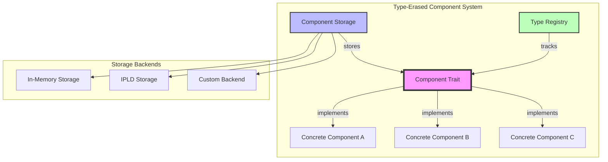
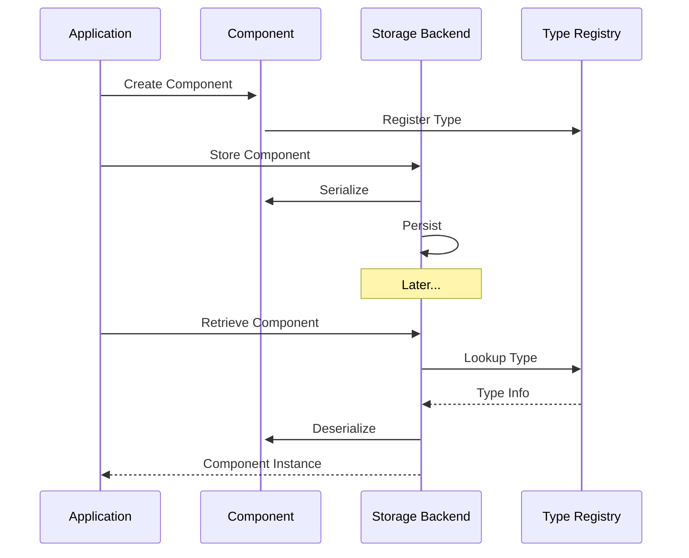
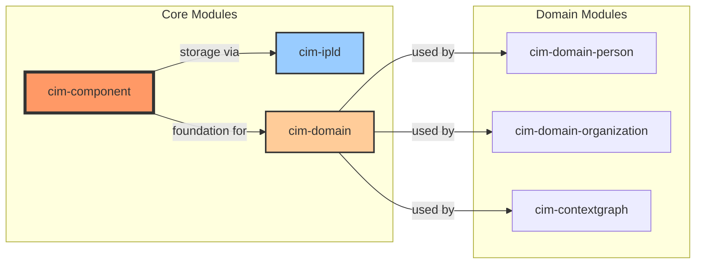
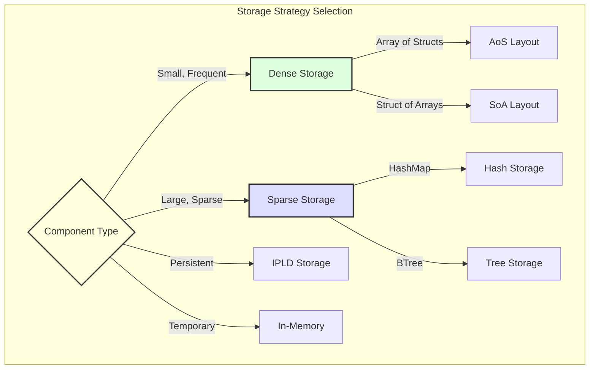
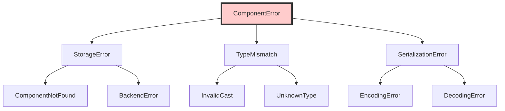

# CIM Component

A foundational type-erased component system for the Content Identity Matrix (CIM), providing the building blocks for Entity Component System (ECS) patterns throughout the CIM architecture.

## Overview

The `cim-component` module provides a flexible, type-erased component system that serves as the foundation for CIM's component-based architecture. It enables storing heterogeneous components without compile-time type knowledge while maintaining type safety and performance.

## Architecture

### Component System Overview



### Component Lifecycle



### Integration with CIM Modules



## Features

- **Type Erasure**: Store components of different types in the same container
- **Serialization Support**: Built-in serialization/deserialization for component persistence
- **Flexible Storage**: Pluggable storage backends (in-memory, IPLD, custom)
- **Thread Safety**: Components and storage are `Send + Sync`
- **Zero Dependencies**: Minimal external dependencies for maximum compatibility
- **Performance**: Optimized for fast component access and iteration

## Quick Start

### Basic Component Definition

```rust
use cim_component::{Component, ComponentStorage, InMemoryStorage};
use serde::{Serialize, Deserialize};
use uuid::Uuid;

#[derive(Debug, Clone, Serialize, Deserialize)]
struct Position {
    x: f32,
    y: f32,
    z: f32,
}

impl Component for Position {
    fn component_type() -> &'static str {
        "Position"
    }
}

#[derive(Debug, Clone, Serialize, Deserialize)]
struct Velocity {
    dx: f32,
    dy: f32,
    dz: f32,
}

impl Component for Velocity {
    fn component_type() -> &'static str {
        "Velocity"
    }
}
```

### Storing and Retrieving Components

```rust
// Create storage
let storage = InMemoryStorage::new();

// Create entity ID
let entity_id = Uuid::new_v4();

// Store components
storage.store(entity_id, Position { x: 0.0, y: 0.0, z: 0.0 })?;
storage.store(entity_id, Velocity { dx: 1.0, dy: 0.0, dz: 0.0 })?;

// Retrieve components
if let Some(pos) = storage.get::<Position>(entity_id)? {
    println!("Position: {:?}", pos);
}

// Query multiple components
for (id, pos, vel) in storage.query::<(Position, Velocity)>()? {
    println!("Entity {} at {:?} moving at {:?}", id, pos, vel);
}
```

### Custom Storage Backend

```rust
use cim_component::{ComponentStorage, StorageError};

struct MyCustomStorage {
    // Custom storage implementation
}

impl ComponentStorage for MyCustomStorage {
    fn store<C: Component>(&self, id: Uuid, component: C) -> Result<(), StorageError> {
        // Implementation
    }
    
    fn get<C: Component>(&self, id: Uuid) -> Result<Option<C>, StorageError> {
        // Implementation
    }
    
    fn remove<C: Component>(&self, id: Uuid) -> Result<(), StorageError> {
        // Implementation
    }
}
```

## Component Storage Strategies



## API Reference

### Core Traits

```rust
pub trait Component: Send + Sync + 'static {
    fn component_type() -> &'static str where Self: Sized;
    fn as_any(&self) -> &dyn Any;
    fn as_any_mut(&mut self) -> &mut dyn Any;
}

pub trait ComponentStorage: Send + Sync {
    fn store<C: Component>(&self, id: Uuid, component: C) -> Result<(), StorageError>;
    fn get<C: Component>(&self, id: Uuid) -> Result<Option<C>, StorageError>;
    fn remove<C: Component>(&self, id: Uuid) -> Result<(), StorageError>;
    fn query<Q: Query>(&self) -> Result<QueryIter<Q>, StorageError>;
}
```

### Error Handling



## Performance Considerations

### Component Access Patterns

```mermaid
graph LR
    subgraph "Access Patterns"
        Random[Random Access] --> Hash[HashMap Storage]
        Sequential[Sequential Access] --> Array[Array Storage]
        Spatial[Spatial Queries] --> Tree[Spatial Tree]
        Temporal[Time-based] --> Ring[Ring Buffer]
    end
    
    subgraph "Optimization"
        Hash --> O1[O(1) Lookup]
        Array --> Cache[Cache Friendly]
        Tree --> Spatial[Spatial Locality]
        Ring --> Temporal[Temporal Locality]
    end
    
    style Random fill:#ffd,stroke:#333,stroke-width:2px
    style Sequential fill:#dfd,stroke:#333,stroke-width:2px
    style Spatial fill:#ddf,stroke:#333,stroke-width:2px
    style Temporal fill:#fdf,stroke:#333,stroke-width:2px
```

## Best Practices

1. **Component Granularity**: Keep components small and focused on a single concern
2. **Avoid Fat Components**: Split large components into multiple smaller ones
3. **Use Value Semantics**: Components should be value types when possible
4. **Minimize Dependencies**: Components should not depend on other components directly
5. **Thread Safety**: Ensure custom components are `Send + Sync`

## Examples

See the `examples/` directory for complete examples:

- `basic_component.rs` - Simple component definition and usage
- `component_storage.rs` - Using different storage backends
- `type_erased_storage.rs` - Storing mixed component types
- `serialization.rs` - Component serialization/deserialization
- `ecs_integration.rs` - Using with ECS patterns

## Testing

```bash
# Run all tests
cargo test

# Run specific test
cargo test test_component_storage

# Run benchmarks
cargo bench
```

## Contributing

Contributions are welcome! Please see the [Contributing Guide](../CONTRIBUTING.md) for details.

## License

Licensed under either of:

- Apache License, Version 2.0 ([LICENSE-APACHE](../LICENSE-APACHE))
- MIT license ([LICENSE-MIT](../LICENSE-MIT))

at your option.