# CIM Component Architecture

## Overview

The CIM Component module provides a foundational type-erased component system that enables flexible, performant storage and retrieval of heterogeneous data types. This document details the architectural decisions and design patterns used in the module.

## Core Architecture

### Layered Design

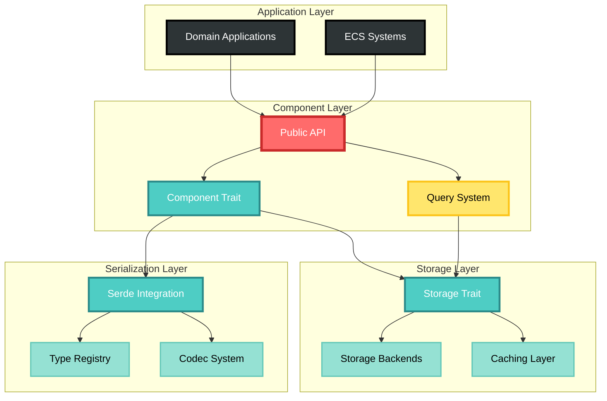

## Type Erasure Strategy

### Type Erasure Flow

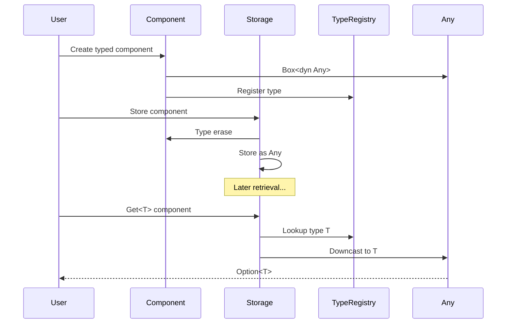

### Type Safety Guarantees

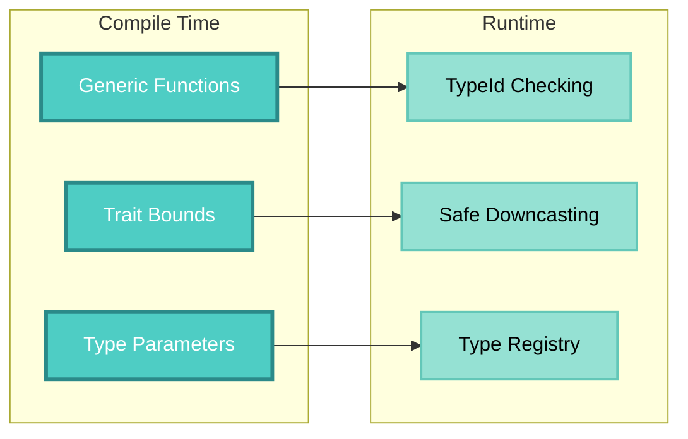

## Storage Architecture

### Storage Backend Interface

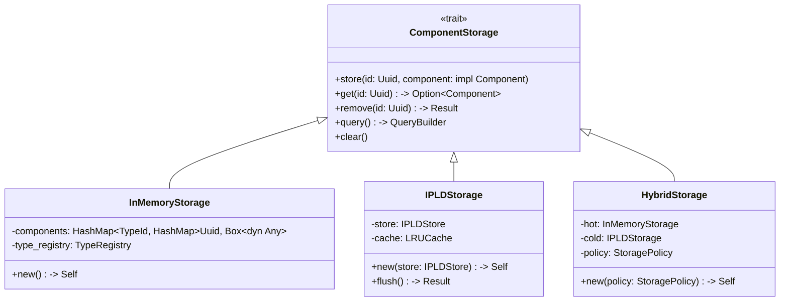

### Storage Selection Strategy

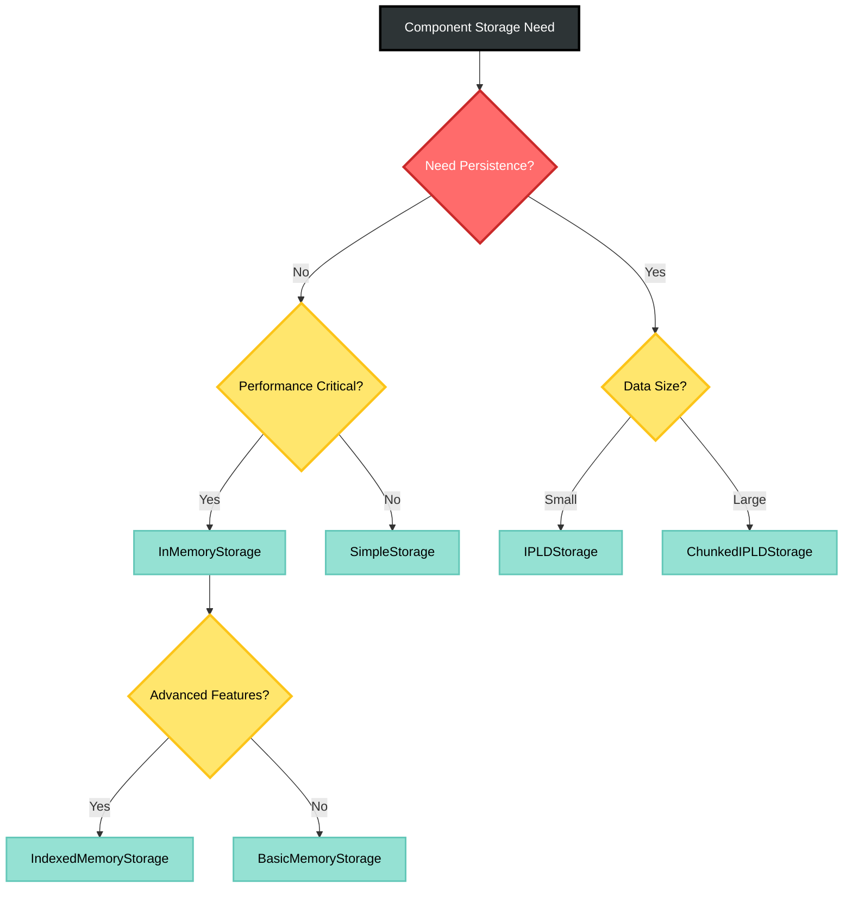

## Query System Architecture

### Query Processing Pipeline

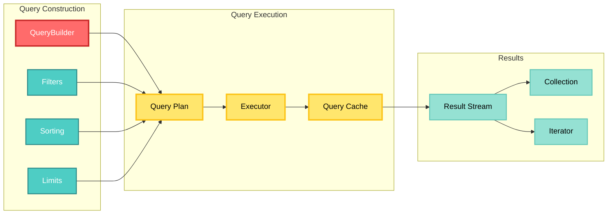

### Query Types

```mermaid
graph TD
    subgraph "Query Types"
        Single[Single Component]
        Tuple[Component Tuple]
        Optional[Optional Components]
        Dynamic[Dynamic Query]
    end
    
    subgraph "Query Patterns"
        Single --> Get[Direct Get]
        Tuple --> Join[Inner Join]
        Optional --> LeftJoin[Left Join]
        Dynamic --> Runtime[Runtime Composition]
    end
    
    subgraph "Optimizations"
        Get --> O1[O(1) Lookup]
        Join --> Index[Index Scan]
        LeftJoin --> Sparse[Sparse Scan]
        Runtime --> JIT[JIT Compilation]
    end
    
    style Single fill:#FF6B6B,stroke:#C92A2A,stroke-width:3px,color:#FFF
    style Tuple fill:#4ECDC4,stroke:#2B8A89,stroke-width:3px,color:#FFF
    style Optional fill:#FFE66D,stroke:#FCC419,stroke-width:3px,color:#000
    style Dynamic fill:#95E1D3,stroke:#63C7B8,stroke-width:3px,color:#000
    style Get fill:#95E1D3,stroke:#63C7B8,stroke-width:2px,color:#000
    style Join fill:#95E1D3,stroke:#63C7B8,stroke-width:2px,color:#000
    style LeftJoin fill:#95E1D3,stroke:#63C7B8,stroke-width:2px,color:#000
    style Runtime fill:#95E1D3,stroke:#63C7B8,stroke-width:2px,color:#000
    style O1 fill:#95E1D3,stroke:#63C7B8,stroke-width:2px,color:#000
    style Index fill:#95E1D3,stroke:#63C7B8,stroke-width:2px,color:#000
    style Sparse fill:#95E1D3,stroke:#63C7B8,stroke-width:2px,color:#000
    style JIT fill:#95E1D3,stroke:#63C7B8,stroke-width:2px,color:#000
```

## Performance Architecture

### Memory Layout Optimization

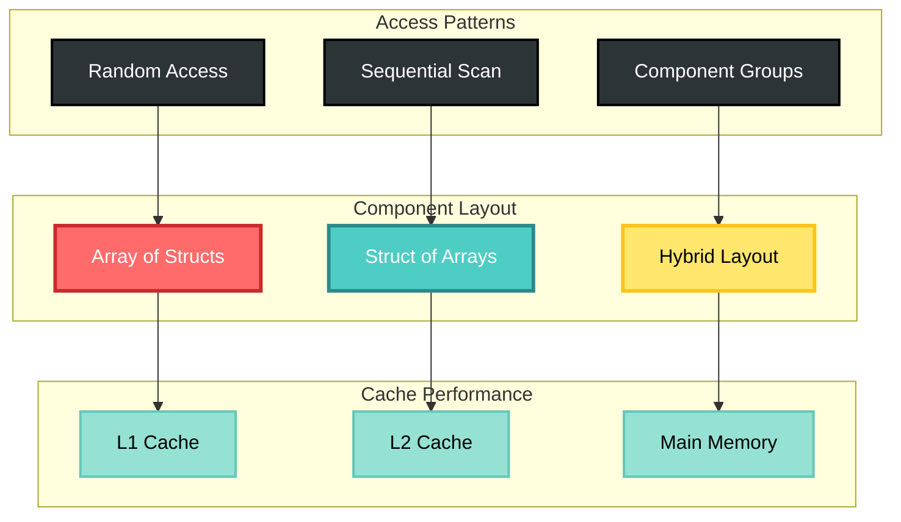

### Concurrency Model

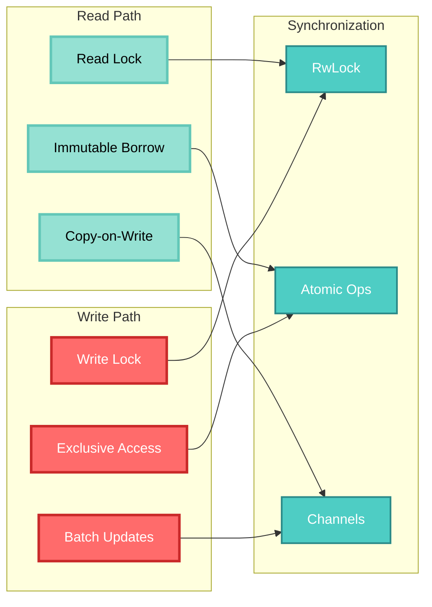

## Serialization Architecture

### Serialization Flow

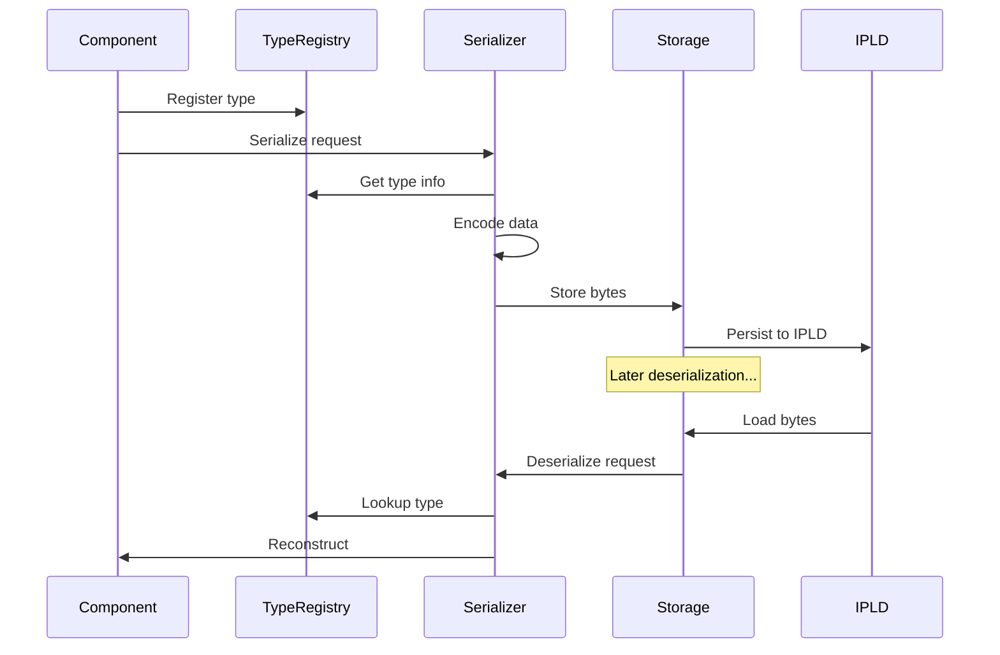

## Error Handling Architecture

### Error Propagation

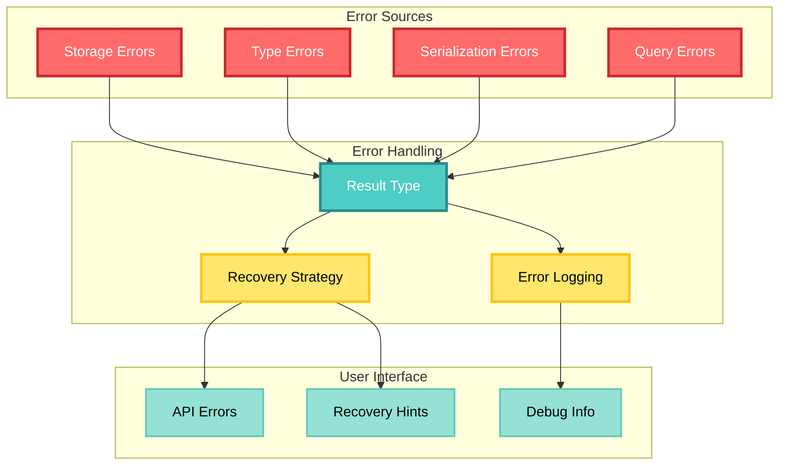

## Extension Points

### Plugin Architecture

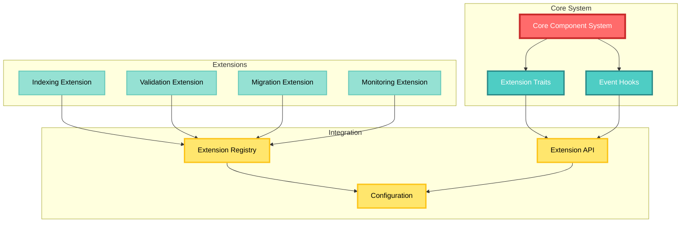

## Security Considerations

### Access Control

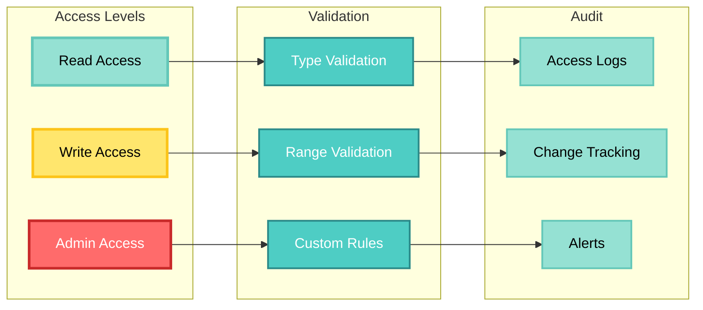

## Future Architecture Considerations

1. **Distributed Components**: Support for components distributed across nodes
2. **GPU Acceleration**: Layout optimization for GPU processing
3. **Reactive Queries**: Push-based query notifications
4. **Schema Evolution**: Automatic component migration
5. **Compression**: Transparent component compression
6. **Federation**: Cross-system component sharing