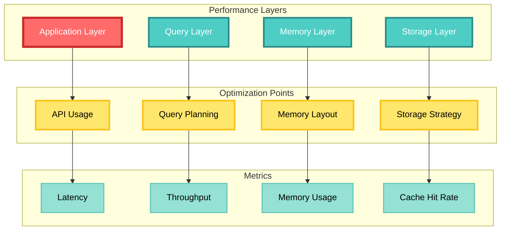
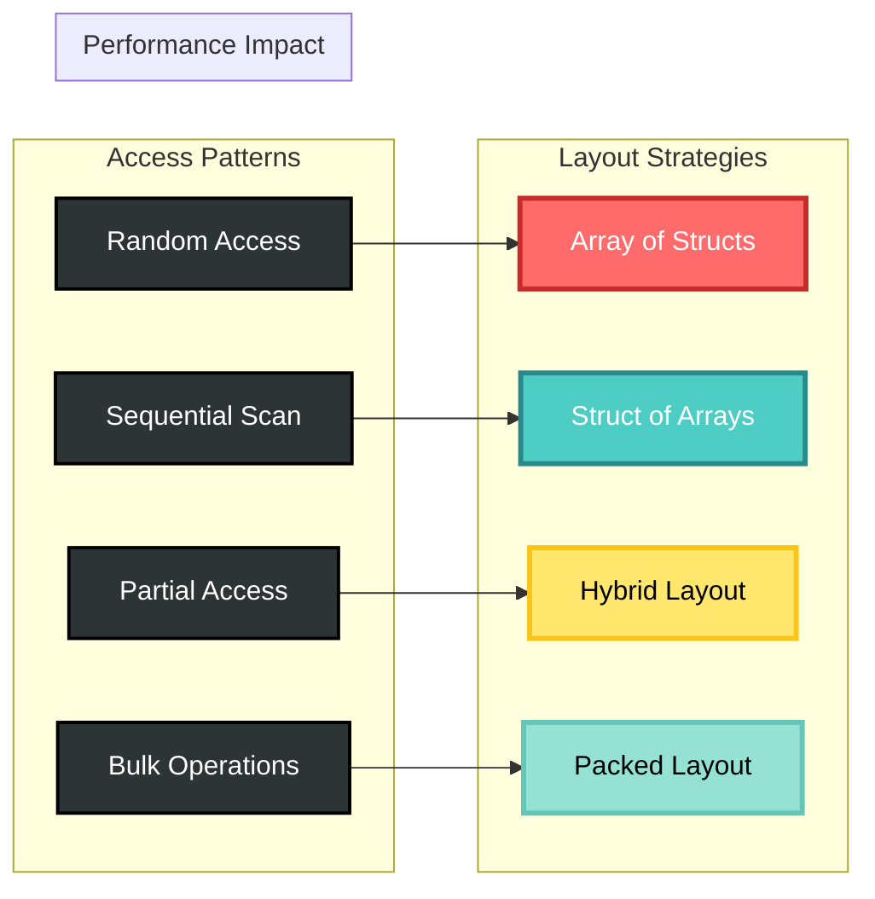
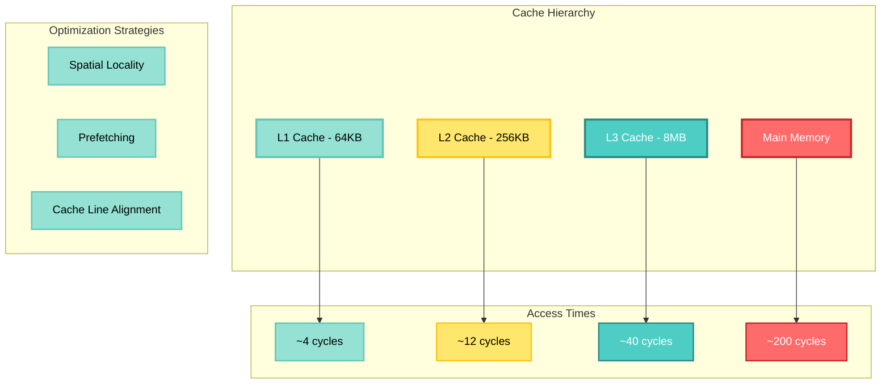
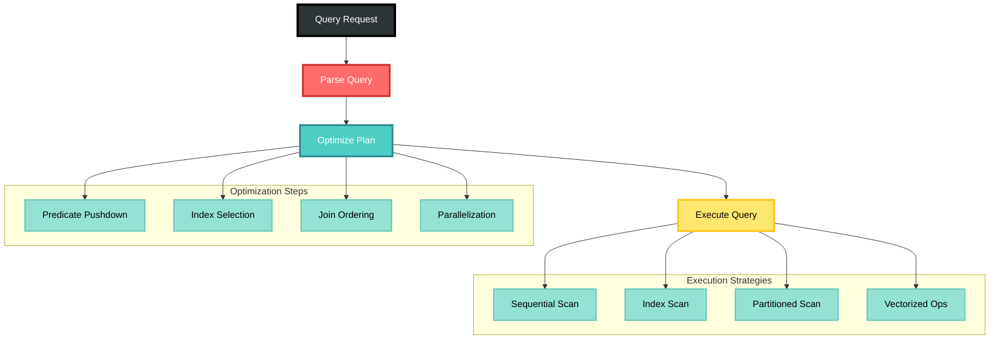
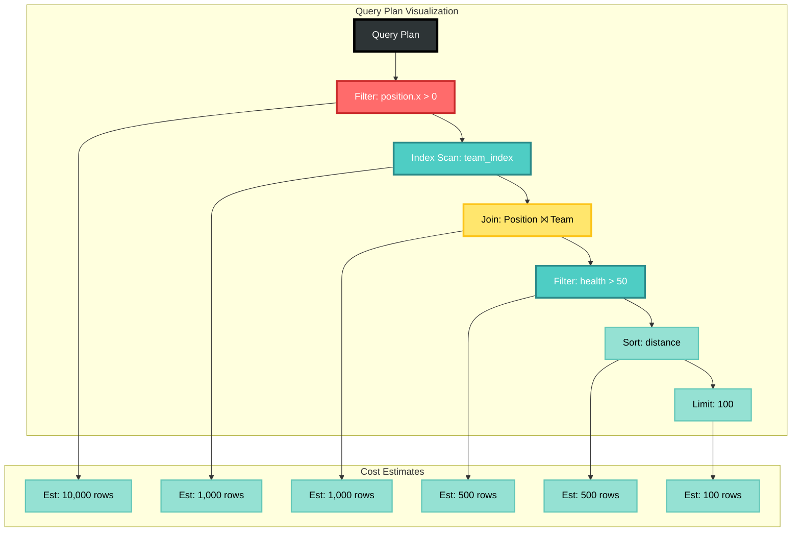
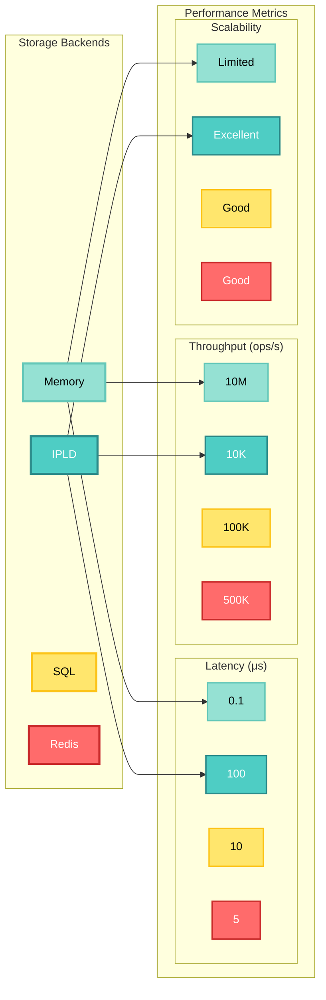
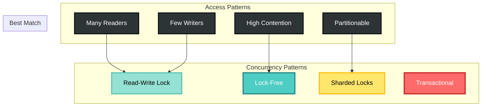
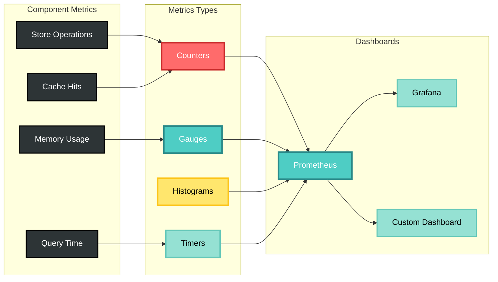
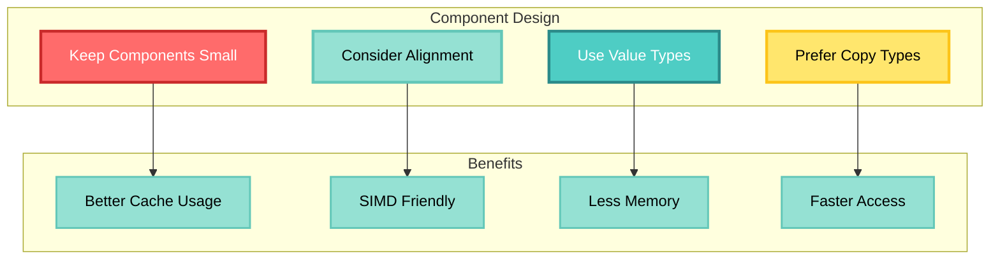
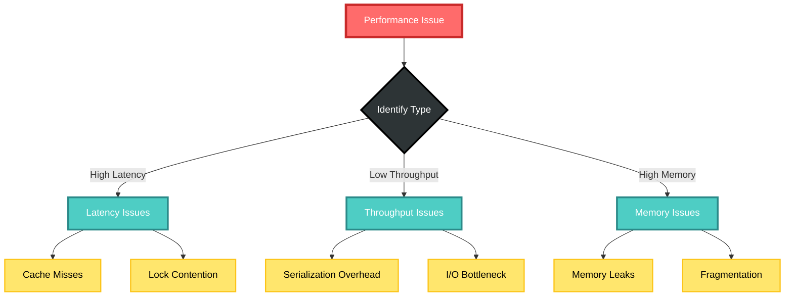

# CIM Component Performance Guide

## Overview

This guide provides comprehensive performance optimization strategies for the CIM Component system. It covers memory layout optimization, query performance tuning, storage backend selection, and concurrent access patterns.

## Performance Architecture



## Memory Layout Optimization

### Component Data Layout



### Memory Layout Examples

```rust
// Array of Structs (AoS) - Good for random access
pub struct PositionAoS {
    positions: Vec<Position>,
}

impl PositionAoS {
    fn get(&self, index: usize) -> Option<&Position> {
        self.positions.get(index)
    }
}

// Struct of Arrays (SoA) - Good for SIMD and cache efficiency
pub struct PositionSoA {
    x: Vec<f32>,
    y: Vec<f32>,
    z: Vec<f32>,
}

impl PositionSoA {
    fn update_all_x(&mut self, delta: f32) {
        // Vectorized operation on contiguous memory
        for x in &mut self.x {
            *x += delta;
        }
    }
}

// Hybrid layout - Balance between AoS and SoA
pub struct HybridLayout {
    hot_data: SoA,      // Frequently accessed
    cold_data: AoS,     // Rarely accessed
}
```

### Cache Optimization



### Cache-Friendly Component Design

```rust
// Cache line size (typically 64 bytes)
const CACHE_LINE_SIZE: usize = 64;

// Aligned component for better cache performance
#[repr(align(64))]
#[derive(Component)]
pub struct CacheAlignedTransform {
    position: Vec3,     // 12 bytes
    rotation: Quat,     // 16 bytes
    scale: Vec3,        // 12 bytes
    _padding: [u8; 24], // Padding to 64 bytes
}

// Hot/Cold data separation
#[derive(Component)]
pub struct OptimizedEntity {
    // Hot data - frequently accessed together
    hot: HotData,
    // Cold data - rarely accessed
    cold: Box<ColdData>,
}

#[repr(C)]
struct HotData {
    position: Vec3,
    velocity: Vec3,
    health: f32,
    _padding: [u8; 4],
}

struct ColdData {
    name: String,
    description: String,
    metadata: HashMap<String, Value>,
}
```

## Query Performance

### Query Optimization Pipeline



### Query Performance Patterns

```rust
// Efficient batch queries
pub fn process_entities_batch(storage: &dyn ComponentStorage) -> Result<()> {
    // Pre-allocate result vector
    let mut results = Vec::with_capacity(10000);
    
    // Use streaming to avoid loading all at once
    let mut stream = storage.query::<(Position, Velocity)>()
        .filter(|(pos, _)| pos.x > 0.0)
        .stream(1000)?;
    
    while let Some(batch) = stream.next_batch()? {
        // Process in parallel
        batch.par_iter()
            .filter(|(_, vel)| vel.magnitude() > 10.0)
            .for_each(|(id, (pos, vel))| {
                // Process entity
            });
    }
    
    Ok(())
}

// Optimized multi-component query
pub fn complex_query_optimized(storage: &dyn ComponentStorage) -> Result<Vec<EntityData>> {
    // Create indices for common queries
    storage.create_index::<Team>("team_id", |t| t.id)?;
    storage.create_index::<Position>("position_quad", |p| {
        let quad_x = (p.x / 100.0) as i32;
        let quad_y = (p.y / 100.0) as i32;
        quad_x * 1000 + quad_y // Spatial hash
    })?;
    
    // Query uses indices automatically
    storage.query::<(Team, Position, Health)>()
        .filter(|(team, _, _)| team.id == player_team)
        .filter(|(_, pos, _)| pos.distance_from(target) < 50.0)
        .filter(|(_, _, health)| health.value > 0)
        .execute()
}
```

### Query Execution Plans



## Storage Performance

### Storage Backend Comparison



### Storage Optimization Techniques

```rust
// Batch operations for better performance
pub async fn batch_store_components(
    storage: &dyn ComponentStorage,
    entities: Vec<(Uuid, Position, Velocity)>,
) -> Result<()> {
    // Group by component type
    let mut positions = Vec::with_capacity(entities.len());
    let mut velocities = Vec::with_capacity(entities.len());
    
    for (id, pos, vel) in entities {
        positions.push((id, pos));
        velocities.push((id, vel));
    }
    
    // Batch store each component type
    storage.batch_store(positions).await?;
    storage.batch_store(velocities).await?;
    
    Ok(())
}

// Compression for large components
#[derive(Component)]
pub struct CompressedTerrain {
    compressed_data: Vec<u8>,
    compression_type: CompressionType,
}

impl CompressedTerrain {
    pub fn new(terrain: &Terrain) -> Result<Self> {
        let data = bincode::serialize(terrain)?;
        let compressed = zstd::encode_all(&data[..], 3)?;
        
        Ok(Self {
            compressed_data: compressed,
            compression_type: CompressionType::Zstd,
        })
    }
    
    pub fn decompress(&self) -> Result<Terrain> {
        let decompressed = zstd::decode_all(&self.compressed_data[..])?;
        bincode::deserialize(&decompressed)
    }
}
```

## Concurrent Access

### Concurrency Model



### Concurrent Component Access

```rust
use dashmap::DashMap;
use parking_lot::RwLock;

// Lock-free concurrent storage using DashMap
pub struct ConcurrentStorage {
    components: Arc<DashMap<TypeId, Arc<DashMap<Uuid, Box<dyn Any + Send + Sync>>>>>,
}

impl ConcurrentStorage {
    pub fn store<C: Component>(&self, id: Uuid, component: C) -> Result<()> {
        let type_id = TypeId::of::<C>();
        let type_map = self.components
            .entry(type_id)
            .or_insert_with(|| Arc::new(DashMap::new()));
        
        type_map.insert(id, Box::new(component));
        Ok(())
    }
    
    pub fn parallel_query<C: Component>(&self) -> impl ParallelIterator<Item = (Uuid, C)> {
        let type_id = TypeId::of::<C>();
        
        self.components
            .get(&type_id)
            .into_par_iter()
            .flat_map(|type_map| {
                type_map.par_iter()
                    .filter_map(|entry| {
                        let (id, component) = entry.pair();
                        component.downcast_ref::<C>()
                            .map(|c| (*id, c.clone()))
                    })
            })
    }
}

// Sharded storage for reduced contention
pub struct ShardedStorage<const SHARDS: usize = 16> {
    shards: [RwLock<HashMap<Uuid, Box<dyn Any + Send + Sync>>>; SHARDS],
}

impl<const SHARDS: usize> ShardedStorage<SHARDS> {
    fn shard_for(&self, id: Uuid) -> usize {
        let hash = id.as_u128() as usize;
        hash % SHARDS
    }
    
    pub fn store<C: Component>(&self, id: Uuid, component: C) -> Result<()> {
        let shard = self.shard_for(id);
        let mut storage = self.shards[shard].write();
        storage.insert(id, Box::new(component));
        Ok(())
    }
}
```

## Performance Monitoring

### Metrics Collection



### Performance Monitoring Implementation

```rust
use metrics::{counter, histogram, gauge};
use std::time::Instant;

pub struct MetricsStorage<S: ComponentStorage> {
    inner: S,
}

impl<S: ComponentStorage> ComponentStorage for MetricsStorage<S> {
    fn store<C: Component>(&self, id: Uuid, component: C) -> Result<()> {
        let start = Instant::now();
        let result = self.inner.store(id, component);
        
        histogram!("component.store.duration", start.elapsed());
        counter!("component.store.total", 1);
        
        if result.is_err() {
            counter!("component.store.errors", 1);
        }
        
        result
    }
    
    fn query<Q: Query>(&self) -> Result<QueryIter<Q>> {
        let start = Instant::now();
        let result = self.inner.query::<Q>();
        
        histogram!("component.query.duration", start.elapsed());
        counter!("component.query.total", 1);
        
        gauge!("component.active_queries", 1.0);
        
        result
    }
}

// Performance profiling
pub fn profile_query<T, F: FnOnce() -> T>(name: &str, f: F) -> T {
    let start = Instant::now();
    let result = f();
    let duration = start.elapsed();
    
    println!("Query '{}' took: {:?}", name, duration);
    
    if duration > Duration::from_millis(100) {
        warn!("Slow query detected: {} ({:?})", name, duration);
    }
    
    result
}
```

## Performance Best Practices

### Component Design Guidelines



### Optimization Checklist

1. **Profile Before Optimizing**
   ```rust
   #[cfg(feature = "profiling")]
   puffin::profile_scope!("complex_query");
   ```

2. **Use Appropriate Data Structures**
   - Dense storage for common components
   - Sparse storage for rare components
   - Indexed storage for frequently queried data

3. **Batch Operations**
   ```rust
   // Good: Batch operations
   storage.batch_store(components)?;
   
   // Bad: Individual operations
   for component in components {
       storage.store(id, component)?;
   }
   ```

4. **Minimize Allocations**
   ```rust
   // Reuse allocations
   let mut results = Vec::with_capacity(expected_size);
   query.collect_into(&mut results)?;
   ```

5. **Use Parallel Processing**
   ```rust
   use rayon::prelude::*;
   
   components.par_iter()
       .filter(|c| c.is_active())
       .for_each(|c| process(c));
   ```

## Performance Troubleshooting

### Common Performance Issues



### Debugging Performance Issues

```rust
// Performance debugging utilities
pub mod debug {
    use std::sync::atomic::{AtomicU64, Ordering};
    
    pub struct PerformanceStats {
        queries: AtomicU64,
        cache_hits: AtomicU64,
        cache_misses: AtomicU64,
        slow_queries: AtomicU64,
    }
    
    impl PerformanceStats {
        pub fn report(&self) {
            let total_queries = self.queries.load(Ordering::Relaxed);
            let cache_hits = self.cache_hits.load(Ordering::Relaxed);
            let cache_misses = self.cache_misses.load(Ordering::Relaxed);
            let hit_rate = cache_hits as f64 / (cache_hits + cache_misses) as f64;
            
            println!("Performance Report:");
            println!("  Total Queries: {}", total_queries);
            println!("  Cache Hit Rate: {:.2}%", hit_rate * 100.0);
            println!("  Slow Queries: {}", self.slow_queries.load(Ordering::Relaxed));
        }
    }
}
```

## Performance Benchmarks

### Benchmark Suite

```rust
use criterion::{black_box, criterion_group, criterion_main, Criterion};

fn bench_component_store(c: &mut Criterion) {
    let storage = InMemoryStorage::new();
    
    c.bench_function("store_single_component", |b| {
        b.iter(|| {
            let id = Uuid::new_v4();
            storage.store(id, Position { 
                x: black_box(1.0), 
                y: black_box(2.0), 
                z: black_box(3.0) 
            })
        })
    });
    
    c.bench_function("query_1000_components", |b| {
        // Setup
        for i in 0..1000 {
            let id = Uuid::new_v4();
            storage.store(id, Position { x: i as f32, y: 0.0, z: 0.0 }).unwrap();
        }
        
        b.iter(|| {
            let count = storage.query::<Position>()
                .filter(|p| p.x > 500.0)
                .count();
            black_box(count);
        })
    });
}

criterion_group!(benches, bench_component_store);
criterion_main!(benches);
```

## Future Performance Improvements

1. **GPU Acceleration**
   - Component processing on GPU
   - Parallel query execution
   - Physics simulation offloading

2. **Advanced Caching**
   - Predictive prefetching
   - Query result caching
   - Adaptive cache sizing

3. **Zero-Copy Operations**
   - Memory-mapped storage
   - Direct buffer access
   - Shared memory components

4. **SIMD Optimization**
   - Vectorized component operations
   - Batch processing
   - Custom allocators