# CIM Component Query System

## Overview

The CIM Component Query System provides a powerful and flexible way to retrieve components from storage. It supports various query patterns from simple single-component lookups to complex multi-component joins with filtering and aggregation.

## Query System Architecture

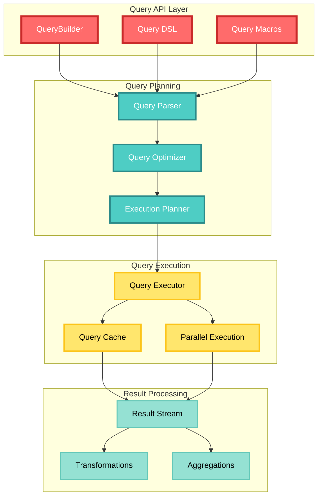

## Query Types

### Single Component Query

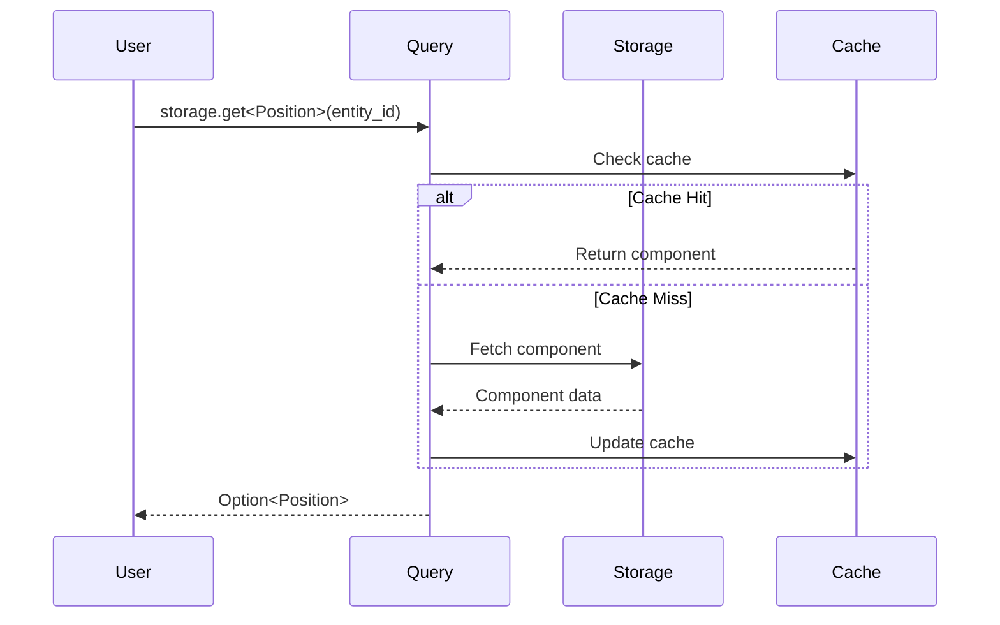

Example:
```rust
// Get a single component
if let Some(position) = storage.get::<Position>(entity_id)? {
    println!("Entity at: {:?}", position);
}

// Get with error handling
match storage.get::<Health>(entity_id) {
    Ok(Some(health)) => println!("Health: {}", health.value),
    Ok(None) => println!("No health component"),
    Err(e) => eprintln!("Error: {}", e),
}
```

### Tuple Query

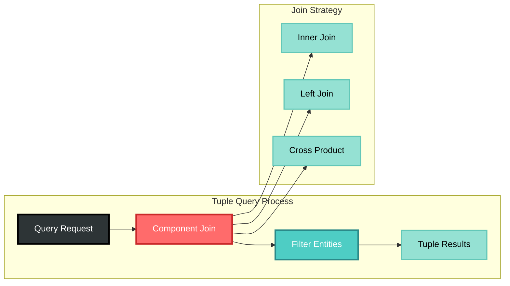

Example:
```rust
// Query entities with both Position and Velocity
for (id, pos, vel) in storage.query::<(Position, Velocity)>()? {
    println!("Entity {} at {:?} moving at {:?}", id, pos, vel);
}

// Query with optional components
for (id, pos, health) in storage.query::<(Position, Option<Health>)>()? {
    match health {
        Some(h) => println!("Entity {} at {:?} with health {}", id, pos, h.value),
        None => println!("Entity {} at {:?} (no health)", id, pos),
    }
}
```

### Filtered Query

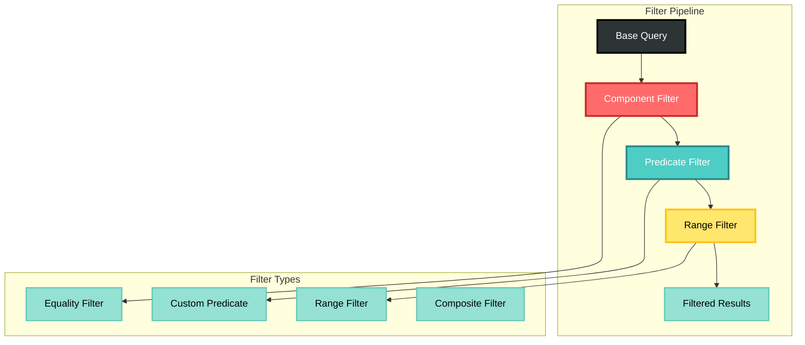

Example:
```rust
// Query with filters
let query = storage.query::<Position>()
    .filter(|pos| pos.x > 0.0 && pos.y > 0.0)
    .filter_range(|pos| pos.z, 0.0..100.0);

for (id, pos) in query.execute()? {
    println!("Entity {} in positive quadrant at {:?}", id, pos);
}

// Complex filtering
let nearby_enemies = storage.query::<(Position, Team)>()
    .filter(|(pos, team)| {
        let distance = (pos.x * pos.x + pos.y * pos.y).sqrt();
        distance < 50.0 && team.id != player_team_id
    })
    .sort_by(|(pos, _)| {
        (pos.x * pos.x + pos.y * pos.y).sqrt()
    });
```

## Query Builder API

### Fluent Interface

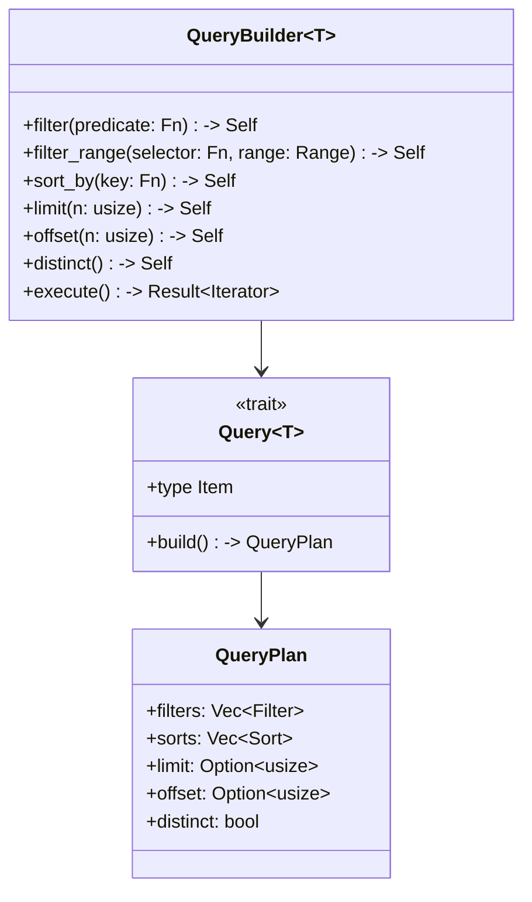

### Query DSL

```rust
// Using the query macro
query! {
    from storage
    select (Position, Velocity, ?Health)
    where position.x > 0 && velocity.magnitude() > 10
    order by position.distance_from_origin()
    limit 100
}

// Equivalent builder pattern
storage.query::<(Position, Velocity, Option<Health>)>()
    .filter(|(pos, vel, _)| pos.x > 0.0 && vel.magnitude() > 10.0)
    .sort_by(|(pos, _, _)| pos.distance_from_origin())
    .limit(100)
    .execute()?
```

## Query Optimization

### Query Planning

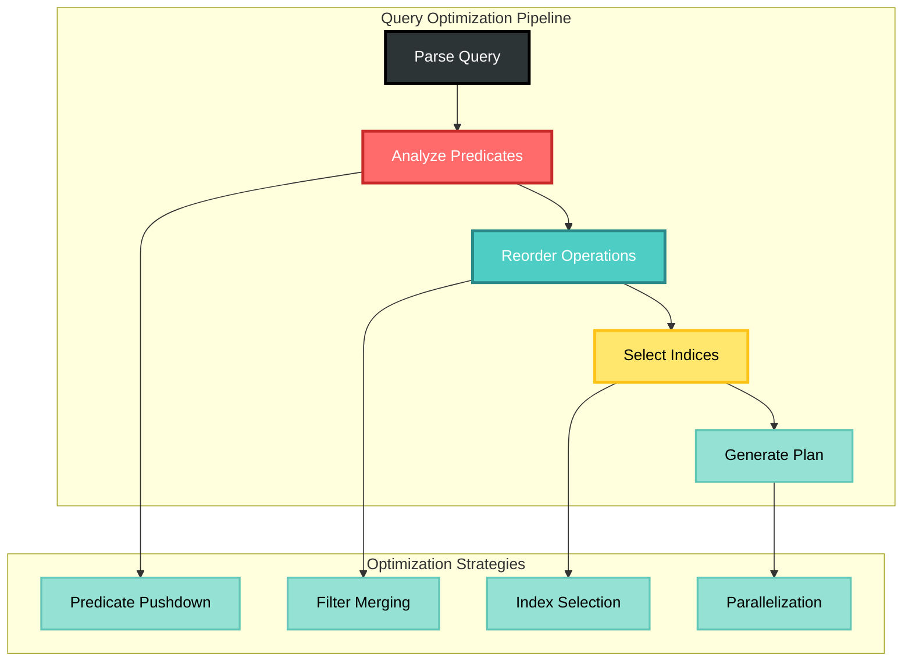

### Index Usage

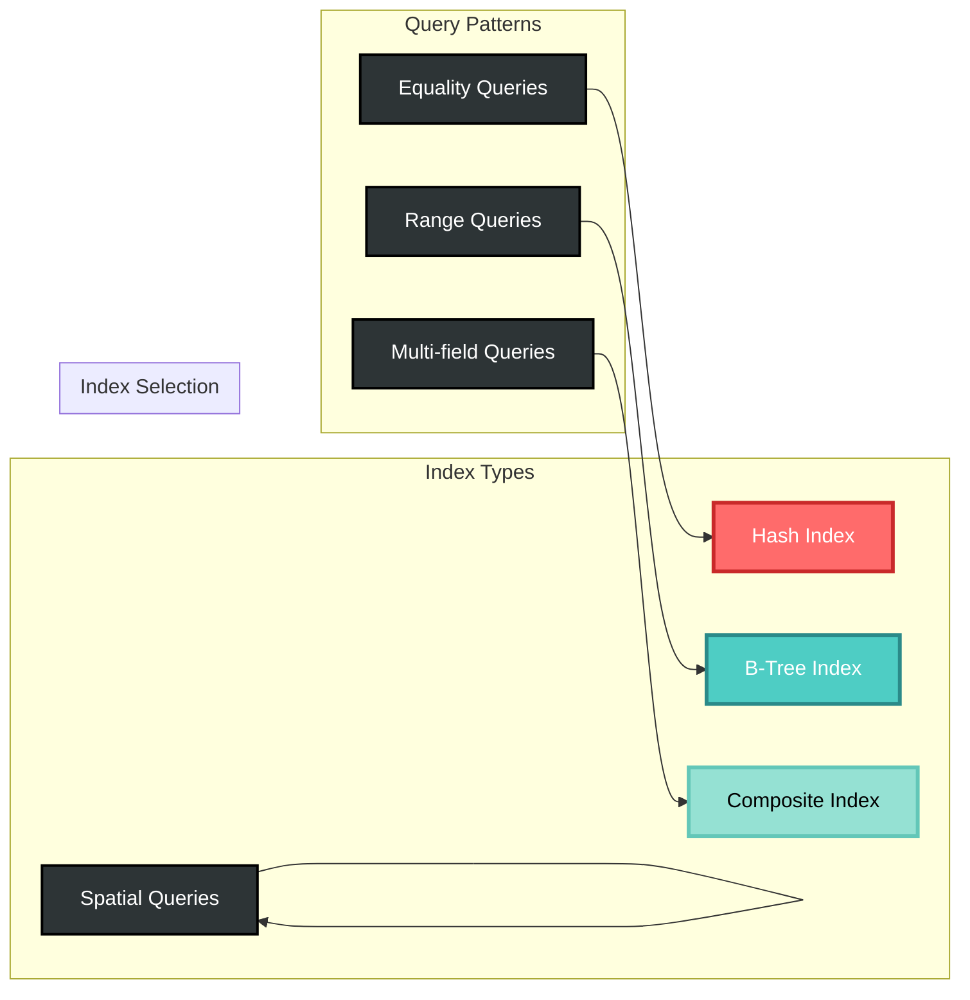

Example index configuration:
```rust
// Define indices for common query patterns
storage.create_index::<Position>("spatial", IndexType::RTree)?;
storage.create_index::<Health>("health_range", IndexType::BTree)?;
storage.create_composite_index::<(Team, Position)>("team_location")?;

// Queries automatically use appropriate indices
let team_members = storage.query::<(Team, Position)>()
    .filter(|(team, _)| team.id == player_team)
    .execute()?; // Uses team_location index
```

## Advanced Query Features

### Aggregation Queries

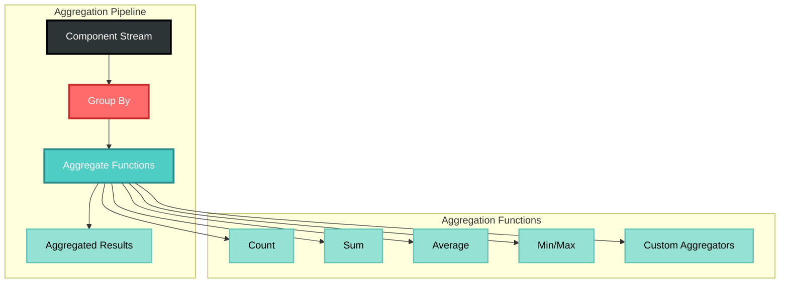

Example:
```rust
// Count entities by team
let team_counts = storage.query::<Team>()
    .group_by(|team| team.id)
    .count();

// Average position by team
let team_positions = storage.query::<(Team, Position)>()
    .group_by(|(team, _)| team.id)
    .aggregate(|positions| {
        let sum = positions.fold(Vec3::ZERO, |acc, (_, pos)| acc + pos.as_vec());
        sum / positions.count() as f32
    });

// Complex aggregation
let stats = storage.query::<(Health, Position, Team)>()
    .group_by(|(_, _, team)| team.id)
    .aggregate_multiple(|entities| {
        let count = entities.count();
        let avg_health = entities.map(|(h, _, _)| h.value).sum() / count as f32;
        let center = entities.map(|(_, p, _)| p.as_vec()).sum() / count as f32;
        TeamStats { count, avg_health, center }
    });
```

### Streaming Queries

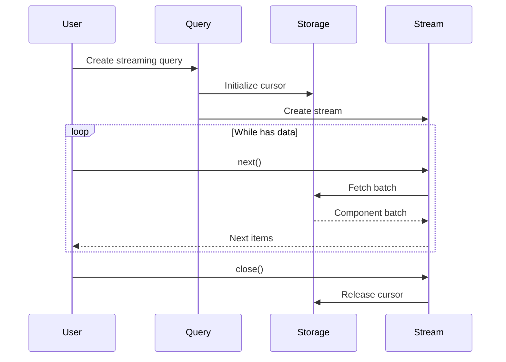

Example:
```rust
// Process large result sets in batches
let mut stream = storage.query::<Position>()
    .stream(1000)?; // Batch size of 1000

while let Some(batch) = stream.next_batch().await? {
    for (id, pos) in batch {
        // Process without loading all results into memory
        process_entity(id, pos).await?;
    }
}

// Async streaming with backpressure
let stream = storage.query::<LargeComponent>()
    .filter(|c| c.active)
    .stream_async(100);

stream
    .for_each_concurrent(10, |batch| async {
        process_batch(batch).await
    })
    .await?;
```

### Query Composition

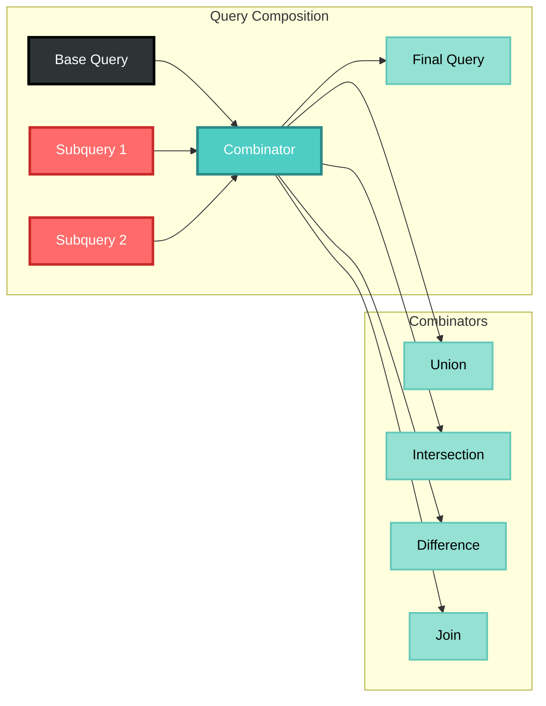

Example:
```rust
// Combine multiple queries
let allies = storage.query::<Team>()
    .filter(|t| t.alliance == Alliance::Friendly);

let nearby = storage.query::<Position>()
    .filter(|p| p.distance_from(player_pos) < 100.0);

let nearby_allies = allies.intersect(nearby)?;

// Complex joins
let result = storage.query::<Position>()
    .join(
        storage.query::<Health>(),
        |id1, id2| id1 == id2
    )
    .left_join(
        storage.query::<Shield>(),
        |id1, id2| id1 == id2
    )
    .execute()?;
```

## Performance Considerations

### Query Performance Matrix

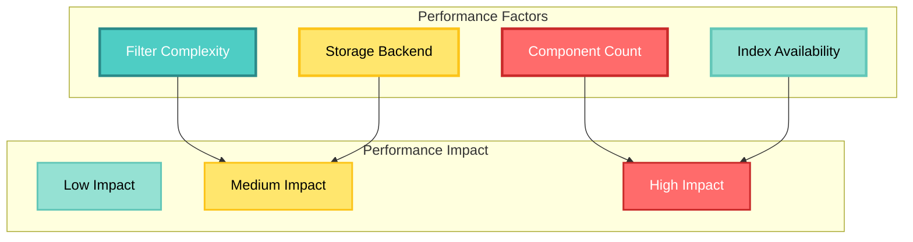

### Optimization Guidelines

1. **Use Indices for Common Queries**
   ```rust
   // Create indices for frequently queried components
   storage.create_index::<Position>("position_x", |p| p.x)?;
   ```

2. **Filter Early, Transform Late**
   ```rust
   // Good: Filter before transformation
   query.filter(|p| p.active).map(|p| expensive_transform(p))
   
   // Bad: Transform before filter
   query.map(|p| expensive_transform(p)).filter(|t| t.active)
   ```

3. **Use Appropriate Query Types**
   ```rust
   // For single lookups
   storage.get::<Position>(id)?
   
   // For bulk operations
   storage.query::<Position>().execute()?
   
   // For large result sets
   storage.query::<Position>().stream(1000)?
   ```

4. **Cache Query Results**
   ```rust
   let cache = QueryCache::new(1000);
   let result = cache.get_or_compute(query_key, || {
       storage.query::<ExpensiveComponent>().execute()
   })?;
   ```

## Query Debugging

### Query Profiling

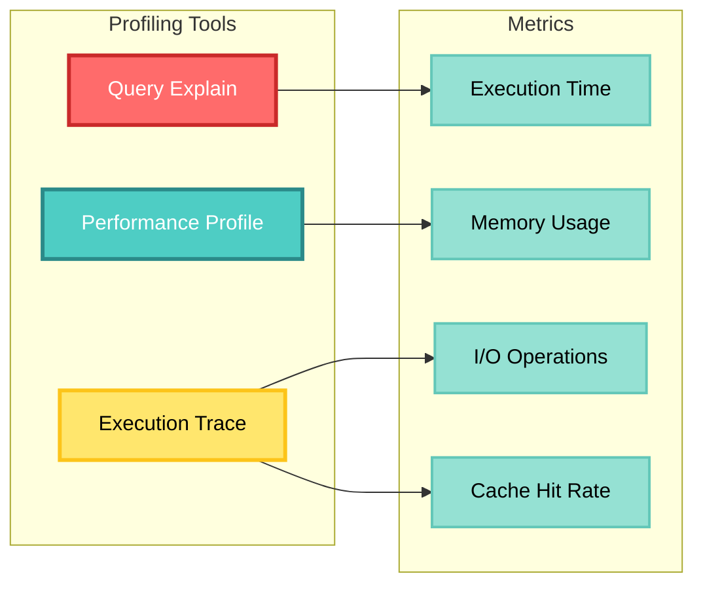

Example:
```rust
// Enable query profiling
let result = storage.query::<Position>()
    .filter(|p| p.x > 0.0)
    .profile()
    .execute()?;

println!("Query stats: {:?}", result.profile_data());
// Output: QueryProfile {
//   execution_time: 1.23ms,
//   components_scanned: 10000,
//   components_returned: 523,
//   index_used: Some("position_x"),
//   cache_hits: 0,
//   cache_misses: 523
// }

// Query explain plan
let plan = storage.query::<(Position, Velocity)>()
    .filter(|(p, v)| p.x > 0.0 && v.magnitude() > 10.0)
    .explain();

println!("Execution plan:\n{}", plan);
// Output:
// 1. Scan index "position_x" where x > 0.0
// 2. Join with Velocity components
// 3. Filter where velocity.magnitude() > 10.0
// 4. Return tuples
```

## Best Practices

1. **Design Queries for Your Access Patterns**
   - Profile actual usage
   - Create appropriate indices
   - Use the right query type

2. **Minimize Memory Usage**
   - Use streaming for large results
   - Project only needed fields
   - Clear caches periodically

3. **Handle Errors Gracefully**
   - Check for component existence
   - Handle storage errors
   - Provide meaningful error messages

4. **Test Query Performance**
   - Benchmark with realistic data
   - Test with concurrent access
   - Monitor production queries