# CIM Component Storage Backends

## Overview

This document details the various storage backend implementations available in the CIM Component system. Each backend is optimized for different use cases and performance characteristics.

## Storage Backend Comparison

```mermaid
graph TB
    subgraph "Storage Backends Overview"
        Memory[In-Memory Storage]
        IPLD[IPLD Storage]
        Hybrid[Hybrid Storage]
        SQL[SQL Storage]
        Custom[Custom Backends]
    end
    
    subgraph "Characteristics"
        Memory --> Fast[Ultra-fast Access]
        Memory --> Volatile[Non-persistent]
        Memory --> Limited[Memory Limited]
        
        IPLD --> Persistent[Persistent]
        IPLD --> Content[Content Addressed]
        IPLD --> Distributed[Distributable]
        
        Hybrid --> Tiered[Tiered Storage]
        Hybrid --> Adaptive[Adaptive Caching]
        Hybrid --> Balanced[Balanced Performance]
        
        SQL --> Queryable[Rich Queries]
        SQL --> Transactional[ACID Transactions]
        SQL --> Relational[Relational Model]
        
        Custom --> Flexible[Flexible]
        Custom --> Specialized[Specialized]
        Custom --> Optimized[Domain Optimized]
    end
    
    style Memory fill:#95E1D3,stroke:#63C7B8,stroke-width:3px,color:#000
    style IPLD fill:#4ECDC4,stroke:#2B8A89,stroke-width:3px,color:#FFF
    style Hybrid fill:#FFE66D,stroke:#FCC419,stroke-width:3px,color:#000
    style SQL fill:#FF6B6B,stroke:#C92A2A,stroke-width:3px,color:#FFF
    style Custom fill:#4ECDC4,stroke:#2B8A89,stroke-width:3px,color:#FFF
    style Fast fill:#95E1D3,stroke:#63C7B8,stroke-width:2px,color:#000
    style Volatile fill:#95E1D3,stroke:#63C7B8,stroke-width:2px,color:#000
    style Limited fill:#95E1D3,stroke:#63C7B8,stroke-width:2px,color:#000
    style Persistent fill:#4ECDC4,stroke:#2B8A89,stroke-width:2px,color:#FFF
    style Content fill:#4ECDC4,stroke:#2B8A89,stroke-width:2px,color:#FFF
    style Distributed fill:#4ECDC4,stroke:#2B8A89,stroke-width:2px,color:#FFF
    style Tiered fill:#FFE66D,stroke:#FCC419,stroke-width:2px,color:#000
    style Adaptive fill:#FFE66D,stroke:#FCC419,stroke-width:2px,color:#000
    style Balanced fill:#FFE66D,stroke:#FCC419,stroke-width:2px,color:#000
    style Queryable fill:#FF6B6B,stroke:#C92A2A,stroke-width:2px,color:#FFF
    style Transactional fill:#FF6B6B,stroke:#C92A2A,stroke-width:2px,color:#FFF
    style Relational fill:#FF6B6B,stroke:#C92A2A,stroke-width:2px,color:#FFF
    style Flexible fill:#4ECDC4,stroke:#2B8A89,stroke-width:2px,color:#FFF
    style Specialized fill:#4ECDC4,stroke:#2B8A89,stroke-width:2px,color:#FFF
    style Optimized fill:#4ECDC4,stroke:#2B8A89,stroke-width:2px,color:#FFF
```

## In-Memory Storage

### Architecture

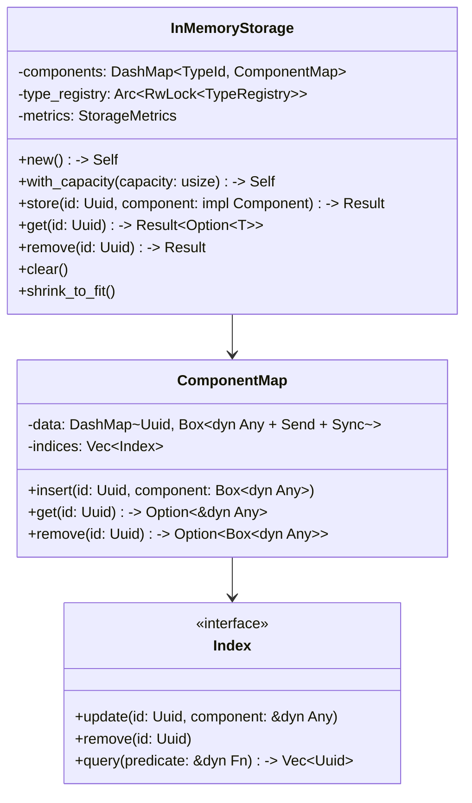

### Performance Characteristics

```mermaid
graph LR
    subgraph "Operation Performance"
        Store[Store: O(1)]
        Get[Get: O(1)]
        Remove[Remove: O(1)]
        Query[Query: O(n)]
        IndexedQuery[Indexed Query: O(log n)]
    end
    
    subgraph "Memory Usage"
        Overhead[~48 bytes/component overhead]
        Scaling[Linear scaling]
        Fragmentation[Possible fragmentation]
    end
    
    subgraph "Concurrency"
        ReadConcurrent[Concurrent reads]
        WriteConcurrent[Concurrent writes]
        LockFree[Lock-free operations]
    end
    
    style Store fill:#95E1D3,stroke:#63C7B8,stroke-width:2px,color:#000
    style Get fill:#95E1D3,stroke:#63C7B8,stroke-width:2px,color:#000
    style Remove fill:#95E1D3,stroke:#63C7B8,stroke-width:2px,color:#000
    style Query fill:#FFE66D,stroke:#FCC419,stroke-width:2px,color:#000
    style IndexedQuery fill:#4ECDC4,stroke:#2B8A89,stroke-width:2px,color:#FFF
    style Overhead fill:#FF6B6B,stroke:#C92A2A,stroke-width:2px,color:#FFF
    style Scaling fill:#FF6B6B,stroke:#C92A2A,stroke-width:2px,color:#FFF
    style Fragmentation fill:#FF6B6B,stroke:#C92A2A,stroke-width:2px,color:#FFF
    style ReadConcurrent fill:#95E1D3,stroke:#63C7B8,stroke-width:2px,color:#000
    style WriteConcurrent fill:#95E1D3,stroke:#63C7B8,stroke-width:2px,color:#000
    style LockFree fill:#95E1D3,stroke:#63C7B8,stroke-width:2px,color:#000
```

### Usage Example

```rust
use cim_component::{InMemoryStorage, ComponentStorage};

// Create storage with default capacity
let storage = InMemoryStorage::new();

// Create storage with pre-allocated capacity
let storage = InMemoryStorage::with_capacity(10000);

// Store components
storage.store(entity_id, Position { x: 0.0, y: 0.0 })?;
storage.store(entity_id, Velocity { dx: 1.0, dy: 0.0 })?;

// Retrieve components
let pos = storage.get::<Position>(entity_id)?;

// Query components
for (id, pos) in storage.query::<Position>()? {
    println!("Entity {} at {:?}", id, pos);
}
```

## IPLD Storage

### Architecture

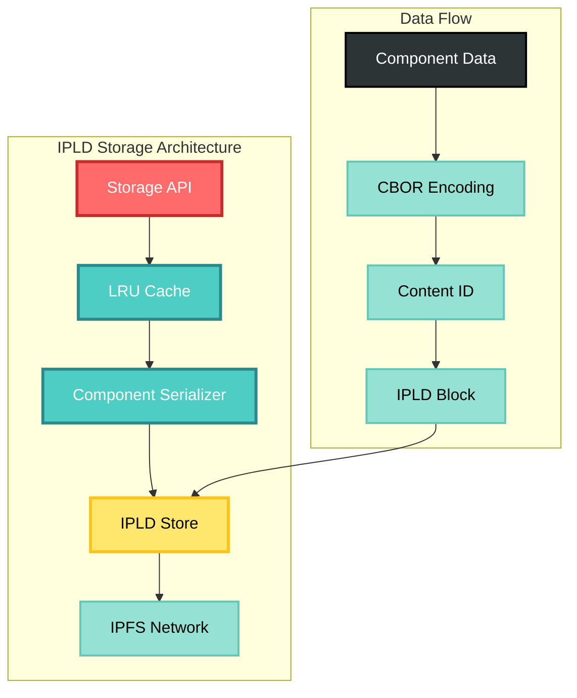

### Storage Layout

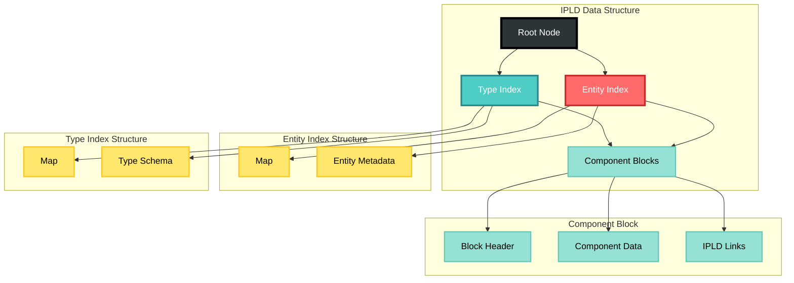

### Configuration Options

```rust
pub struct IPLDStorageConfig {
    /// Cache size in number of components
    pub cache_size: usize,
    
    /// Write batch size for bulk operations
    pub batch_size: usize,
    
    /// Enable compression for component data
    pub compression: CompressionType,
    
    /// Replication factor for distributed storage
    pub replication_factor: u8,
    
    /// Pin important data to prevent garbage collection
    pub pinning_strategy: PinningStrategy,
}

impl Default for IPLDStorageConfig {
    fn default() -> Self {
        Self {
            cache_size: 10000,
            batch_size: 100,
            compression: CompressionType::None,
            replication_factor: 3,
            pinning_strategy: PinningStrategy::Automatic,
        }
    }
}
```

## Hybrid Storage

### Tiered Storage Architecture

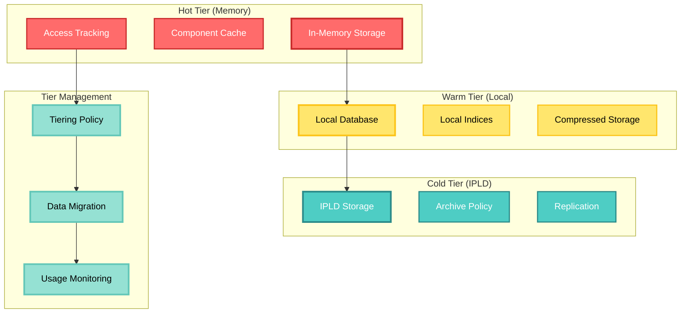

### Access Pattern Optimization

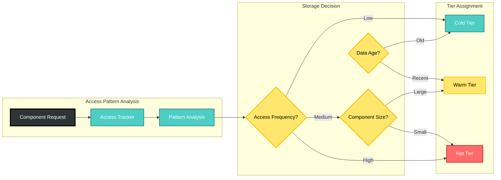

### Configuration Example

```rust
use cim_component::{HybridStorage, TieringPolicy};

let policy = TieringPolicy::builder()
    .hot_threshold(Duration::from_secs(300))  // 5 minutes
    .warm_threshold(Duration::from_hours(24))  // 1 day
    .access_count_threshold(10)                // 10 accesses
    .size_threshold(1024 * 1024)              // 1 MB
    .build();

let storage = HybridStorage::new(
    InMemoryStorage::with_capacity(10000),
    IPLDStorage::new(ipld_config),
    policy
);

// Components automatically migrate between tiers
storage.store(entity_id, large_component)?;
```

## SQL Storage Backend

### Schema Design

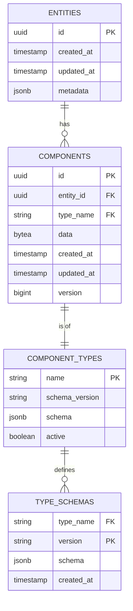

### Query Optimization

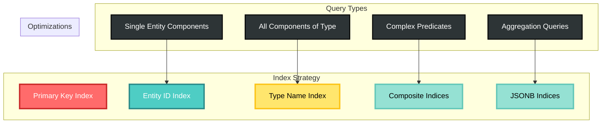

## Custom Storage Backends

### Implementation Guide

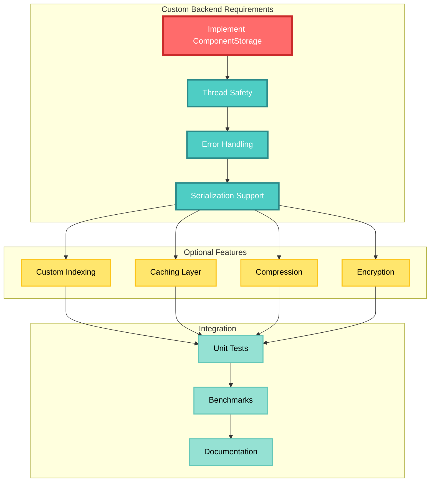

### Example Custom Backend

```rust
use cim_component::{ComponentStorage, StorageError, Component};

pub struct RedisStorage {
    client: redis::Client,
    serializer: ComponentSerializer,
}

impl ComponentStorage for RedisStorage {
    fn store<C: Component>(&self, id: Uuid, component: C) -> Result<(), StorageError> {
        let key = format!("component:{}:{}", C::component_type(), id);
        let data = self.serializer.serialize(&component)?;
        
        let mut conn = self.client.get_connection()
            .map_err(|e| StorageError::Backend(e.into()))?;
            
        conn.set(key, data)
            .map_err(|e| StorageError::Backend(e.into()))?;
            
        Ok(())
    }
    
    fn get<C: Component>(&self, id: Uuid) -> Result<Option<C>, StorageError> {
        let key = format!("component:{}:{}", C::component_type(), id);
        
        let mut conn = self.client.get_connection()
            .map_err(|e| StorageError::Backend(e.into()))?;
            
        let data: Option<Vec<u8>> = conn.get(key)
            .map_err(|e| StorageError::Backend(e.into()))?;
            
        match data {
            Some(bytes) => {
                let component = self.serializer.deserialize(&bytes)?;
                Ok(Some(component))
            }
            None => Ok(None),
        }
    }
    
    // Additional trait methods...
}
```

## Performance Benchmarks

### Comparative Performance

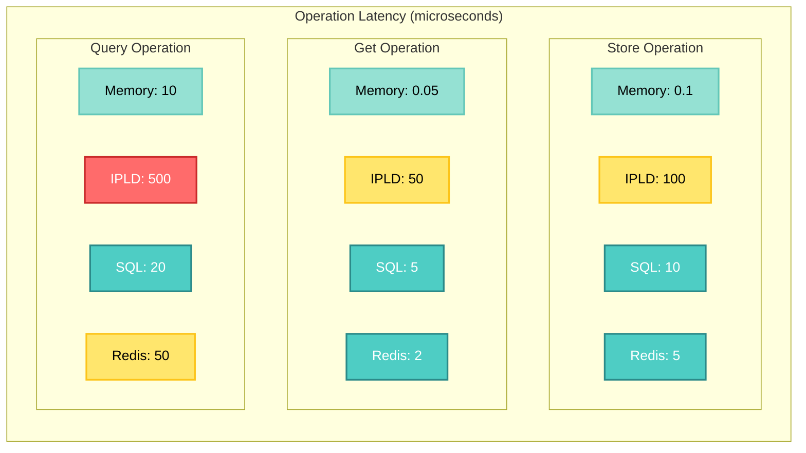

## Storage Selection Guide

### Decision Matrix

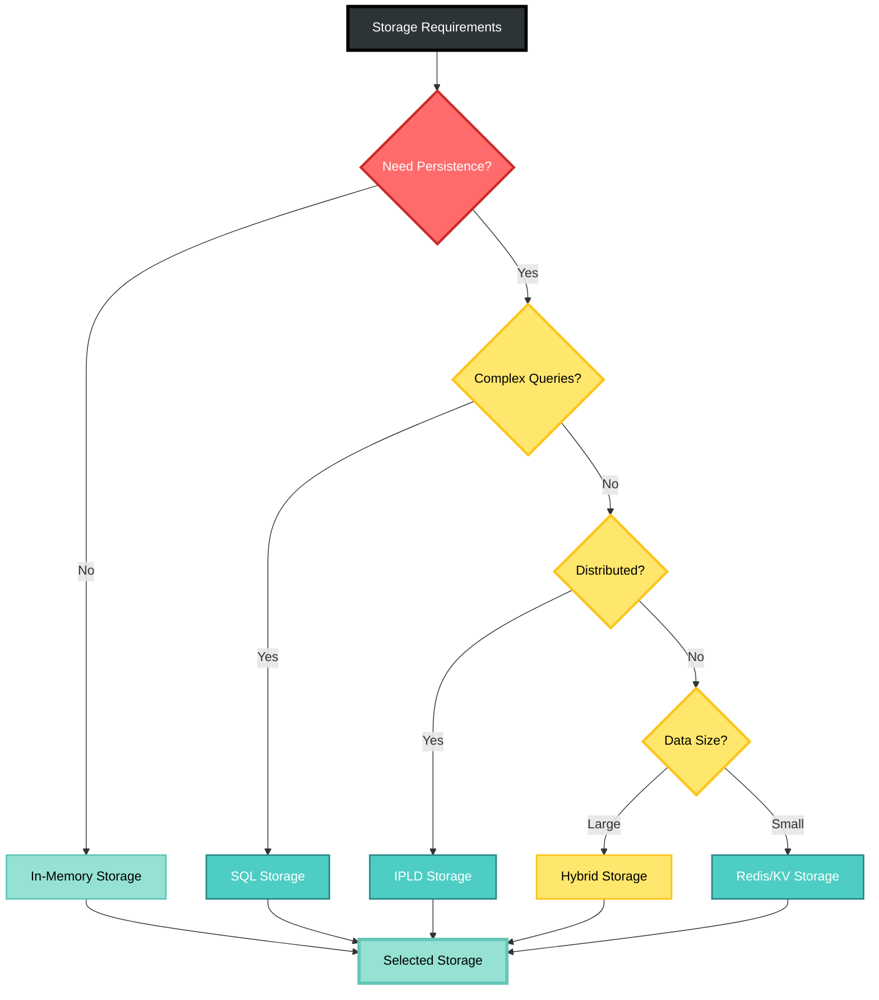

## Best Practices

1. **Choose Based on Access Patterns**
   - Random access → HashMap-based storage
   - Sequential access → Array-based storage
   - Complex queries → SQL storage

2. **Consider Data Lifecycle**
   - Short-lived → In-memory storage
   - Long-lived → Persistent storage
   - Mixed → Hybrid storage

3. **Optimize for Common Case**
   - Profile actual usage
   - Benchmark with real data
   - Monitor performance metrics

4. **Plan for Scale**
   - Estimate data growth
   - Design for distribution
   - Implement proper indices

5. **Handle Failures Gracefully**
   - Implement retries
   - Use circuit breakers
   - Provide fallback storage